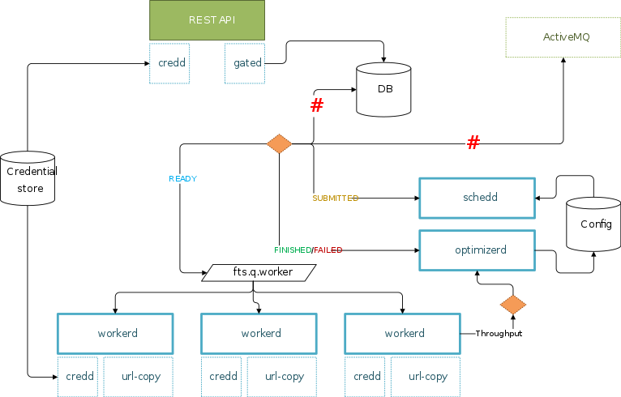

# Design

## Overview
The idea for Flutter is to have a set of separate processes that communicate
with each other asynchronously using messaging. This provides a well defined
API oblivious to the programming language and/or framework chosen
for each component.

With this schema, we have a greater flexibility for both independent scaling,
and development.

## Details
* [State Machine](state_machine.md)
* [Processes](processed.md)
* [Scheduler](scheduler.md)
* [Technology Stack](tech_stack.md)
