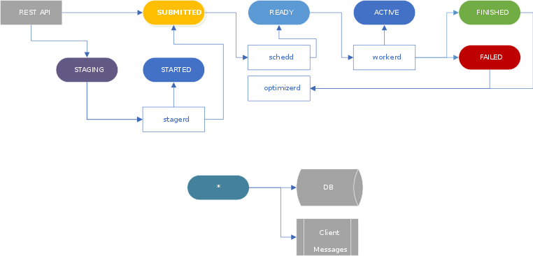

## Processes

## stagerd
Consumes `STAGING` transfers. It triggers a `STARTED` transition when the
staging operation is about to be sent to the remote storage.

Once the operation is done, the transfer moves into `SUBMITTED`, or, if it
was a staging-only job, into a terminal state.

* *Needs to scale*: Yes, but since we can do bulk operations, and the process
is asynchronous anyway, this is not resource intensive.

## schedd
See the page about the [scheduler](scheduler.md).

Consumes `SUBMITTED`, populates an internal queue struct, and decide when a
transfer is `READY` to run.

* *Needs to scale*: The view of the queue has to be consistent across instances,
so it is easier to have only one instance taking decisions (can have backups).
Disjoint subsets of the "queue" may be sharded if scalability is finally required.

## optimizerd
The optimizer consumes terminal messages, so it can adapt the number of actives
to the load on the storages. When it takes a decision, it updates the scheduler
configuration.

It should emit a message to a topic announcing its decision (for logging).

* *Needs to scale*: Similar to the scheduler, only can be scaled for disjoint
subsets. FTS can run without an optimizer. A crash will not cause downtime,
but may cause transfer performance issues.

## workerd
Consumes `READY` transfers, spawns url-copy processes (`ACTIVE`)
and monitors them.
Transfer logs are generated by these url-copy processes, so need to either
recover, or store somewhere reachable (shared volume?).

When done, transfers go either to `FINISHED` or `FAILED`. In the case of
multiple replicas, or retries, they may go into `SUBMITTED` again.

During the transfer, several progress/throughput messages can be sent.

* *Needs to scale*: Absolutely. The number of workers limits the number of
transfers we can run. This also means they are dispensable when the load is
reduced.

## Others
### Database
Even if the whole system can work without a **central** database, storing state
transitions is convenient for all parties involved. It consumes all messages
generated by other processes, and store them asynchronously.

### Client messaging
Terminal and state transition messages need to be reformatted and forwarded to
external topics (which may be on an external broker). These messages will be
consumed by the [Dashboard](http://dashb-fts-transfers.cern.ch/ui/) and the clients.
