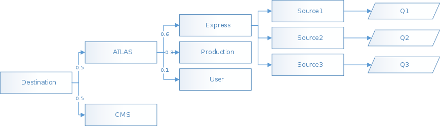

# Scheduler

The scheduler is the most complicate machinery on FTS. The "queue" on FTS
looks a bit like the graph on top.

The number of slots for a given source and destination is limited by the
resources of the nodes and the network in between. Therefore, FTS needs
to share this amount of slots between VOs, and, within each VO, between
activity shares (which are basically priorities).

Once FTS has decided on a combination of Source, Destination, VO and Activity,
it will pick the first transfer on the queue that matches that combination.

As the graph shows, different branches have, or may have, different weights,
so the chance of a given combination is not the same chance as any other
combination.

When having a given number of slots, we need to assign each one of them
individually to avoid starving. The idea is similar to the [Lottery Scheduling](https://en.wikipedia.org/wiki/Lottery_scheduling).

It is important to remember that each source may be shared by other
destinations!
